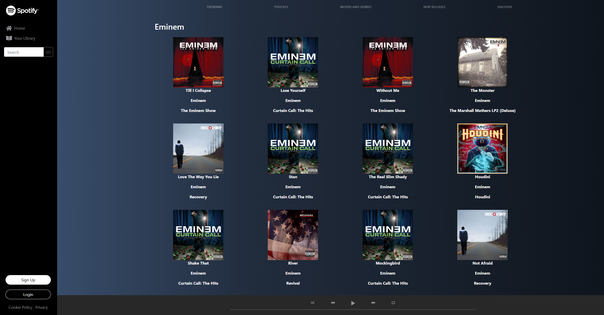

# Spotify Music Search Clone

<p align="center">
  <a href="https://github.com/EmanWeBdV/EPICODE_M4-W1D4">
    
  </a>
</p>

<p align="center">
  A responsive <strong>Spotify-style music browser</strong> built with HTML, CSS and JavaScript.<br/>
  Focus on API calls, dynamic rendering, search functionality and music-themed UI composition.<br/>
  <strong>This project was created during Module M4 of the Epicode course.</strong>
</p>

<p align="center">
  <a href="https://github.com/EmanWeBdV/EPICODE_M4-W1D4">
    
  </a>
  <a href="https://github.com/EmanWeBdV/EPICODE_M4-W1D4/issues">
    
  </a>
  <a href="#">
    
  </a>
</p>

<p align="center">
  <a href="#-preview">Preview</a>
  ·
  <a href="#-demo">Demo</a>
  ·
  <a href="https://github.com/EmanWeBdV/EPICODE_M4-W1D4/issues">Report a bug</a>
  ·
  <a href="https://github.com/EmanWeBdV/EPICODE_M4-W1D4/issues">Request a feature</a>
</p>

---

## ✨ Preview

> Add your screenshot here if needed.

<p align="center">
  
</p>

---

## 🔗 Demo

- **Live demo:** https://emanwebdv.github.io/EPICODE_M4-W1D4/

---

## 🧭 Table of Contents

- [Preview](#-preview)
- [Demo](#-demo)
- [Features](#-features)
- [Tech Stack](#-tech-stack)
- [Project Structure](#-project-structure)
- [Installation](#-installation)
- [Usage](#-usage)
- [API Integration](#-api-integration)
- [Responsiveness](#-responsiveness)
- [Roadmap](#-roadmap)
- [Author](#-author)
- [License](#-license)
- [Disclaimer](#-disclaimer)

---

## 🚀 Features

- **Spotify-inspired layout**
  - Vertical sidebar navigation
  - Spotify logo and music platform styling
  - Bottom music player section
  - Main content area with categories and artist sections

- **Preloaded artist sections**
  - Dedicated sections for:
    - **Eminem**
    - **Metallica**
    - **Queen**
  - Dynamic rendering of tracks and album covers

- **Search functionality**
  - Input field to search any artist
  - Search button to trigger API request
  - Dynamic search results section generated with JavaScript

- **Dynamic DOM rendering**
  - Album cover image
  - Song title
  - Artist name
  - Album title
  - Content generated programmatically from API data

- **Interactive UI**
  - Hover effects for navigation and images
  - Responsive layout behavior
  - Music-player-inspired footer controls

- **Educational Context**
  - Built as a frontend exercise to practice API calls, asynchronous JavaScript, DOM manipulation and layout composition

---

## 🧱 Tech Stack

<p align="left">
  
  
  
  
  
</p>

---

## 📂 Project Structure

```bash
.
├── index.html
├── assets
│   ├── css
│   │   └── style.css
│   ├── js
│   │   └── script.js
│   └── img
│       ├── logo/
│       ├── playerbuttons/
│       └── ...other assets
└── README.md
